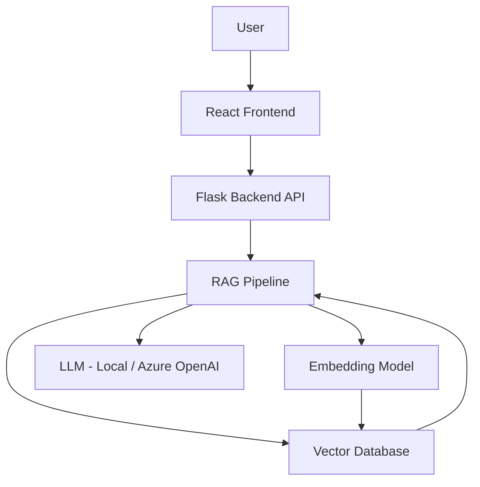
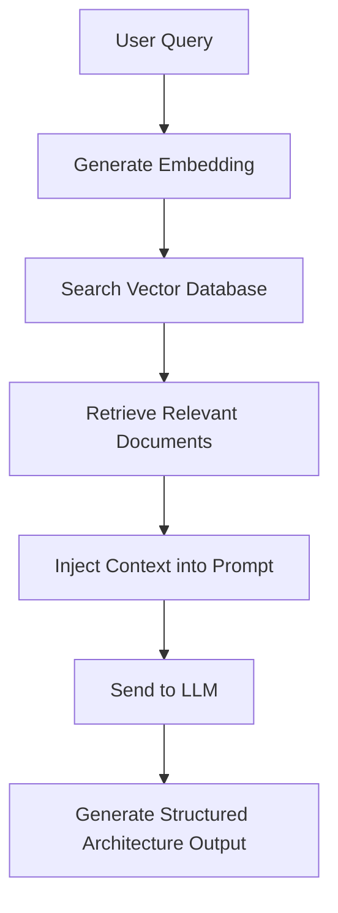

# 🧠 AI System Design Architect

> A Generative AI-powered system that converts product ideas into scalable, production-ready system architectures using RAG, Vector Databases, and Cloud-native design principles.

---

## 🚀 Project Overview

AI System Design Architect is a full-stack GenAI application that helps engineers design scalable distributed systems.

Given a product idea like:

> “Design a video streaming platform for 5 million users”

The system generates:

- Functional Requirements  
- Non-Functional Requirements  
- High-Level Architecture  
- Database Design  
- Scaling Strategy  
- Azure Cloud Mapping  
- Trade-off Analysis  

This project demonstrates real-world application of **Retrieval-Augmented Generation (RAG)** and cloud-integrated AI systems.

---

## 🎯 Problem Statement

System design requires:

- Distributed systems knowledge  
- Cloud infrastructure understanding  
- Scaling strategy experience  
- Awareness of trade-offs  

This project aims to build an AI-powered assistant that supports engineers in making structured, scalable architectural decisions.

---

## 🏗 High-Level Architecture

---

## 🔍 RAG Pipeline Flow

---

## 🛠 Tech Stack

### 🖥 Frontend
- React  
- REST API Integration  
- Dynamic Result Visualization  

### ⚙ Backend
- Python  
- Flask (API Layer)  
- Prompt Orchestration  
- RAG Pipeline Integration  

### 🧠 AI Layer
- Large Language Model (Local / Azure OpenAI)  
- Embedding Generation  
- Vector Similarity Search  
- Context-Aware Prompt Injection  

### ☁ Cloud (Planned Deployment)
- Azure App Service  
- Azure Blob Storage  
- Azure OpenAI (Future Phase)  
- Azure AI Search / Vector Database  

---

## 🧩 Core System Components

### 1️⃣ React Frontend
- User input interface  
- Architecture output display  
- Future: history tracking & diagram rendering  

### 2️⃣ Flask Backend
- REST API endpoints  
- RAG orchestration  
- Prompt engineering logic  
- Structured response formatting  

### 3️⃣ Vector Database
- Stores architecture knowledge base  
- Enables semantic similarity search  

### 4️⃣ LLM Engine
- Generates scalable system architecture responses  
- Uses retrieved contextual knowledge  

---

## 📦 Planned Features

- [ ] Structured system design output format  
- [ ] Clarifying question generation  
- [ ] Azure cloud service recommendations  
- [ ] Cost estimation module  
- [ ] Architecture diagram auto-generation  
- [ ] Multi-model support  
- [ ] Deployment on Azure  

---

## 📚 Learning Objectives

This project demonstrates:

- Retrieval-Augmented Generation (RAG)  
- Vector Databases  
- Prompt Engineering  
- Full-Stack AI Application Design  
- Cloud-Native Architecture Planning  
- Scalable GenAI System Orchestration  

---

## 🗺 Roadmap

### Phase 1  
Basic LLM-powered architecture generator.

### Phase 2  
Implement RAG with vector database.

### Phase 3  
Azure deployment & cloud integration.

### Phase 4  
Advanced AI features & system optimization.

---

## 👥 Team

- Rahul Mahapatra  
- Rishabh Kumar Singh  

---
