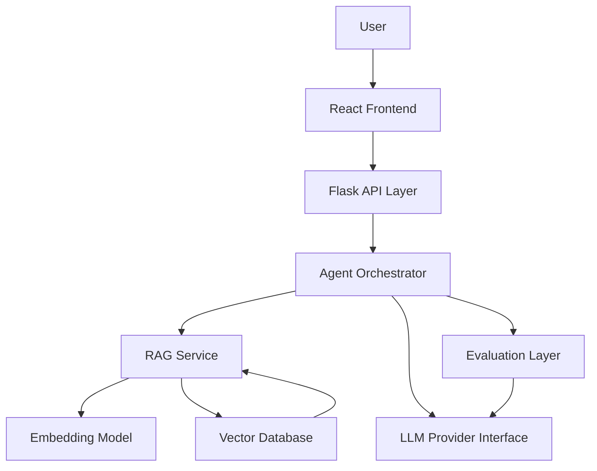
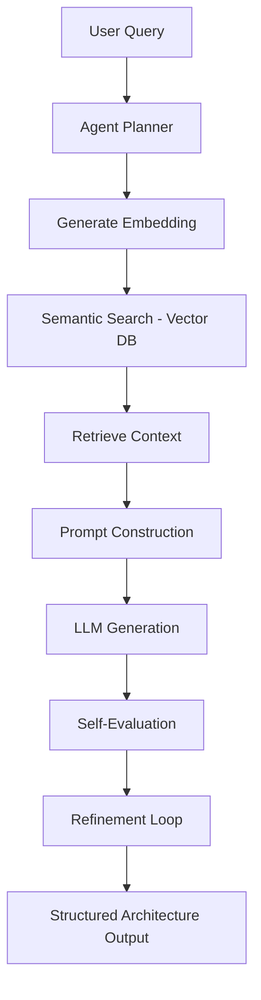

# 🧠 AI System Design Architect

> A Production-Grade, Agentic RAG-powered AI system that converts product ideas into scalable, production-ready system architectures using Vector Databases and Cloud-native design principles.

---

## 🚀 Project Vision

AI System Design Architect is a full-stack Generative AI system designed to assist engineers in designing scalable distributed systems.

Given a product idea like:

> “Design a video streaming platform for 5 million users”

The system intelligently:

- Breaks down the problem
- Retrieves relevant architecture knowledge
- Plans system components
- Generates structured design output
- Evaluates architectural risks
- Maps infrastructure to Azure cloud
- Refines the output through agentic reasoning

This is not just an LLM wrapper — it is designed as a **modular, observable, production-grade AI architecture engine**.

---

## 🏗 High-Level Production Architecture



---

## 🔍 RAG + Agent Workflow



---

## 🤖 Core Capabilities

### 1️⃣ Retrieval-Augmented Generation (RAG)
- Document chunking strategy
- Embedding-based semantic retrieval
- Context injection into LLM prompts
- Vector similarity search

### 2️⃣ Agentic Orchestration
- Multi-step reasoning
- Task planning
- Iterative refinement
- Tool-calling support (planned)

### 3️⃣ Structured Output
- JSON-based architecture schema
- Validated response format
- Typed system components

Example output schema:

```json
{
  "functional_requirements": [],
  "non_functional_requirements": [],
  "architecture_components": [],
  "database_design": [],
  "azure_mapping": [],
  "risks": []
}
```

### 4️⃣ Evaluation Layer
- Detects missing scalability components
- Identifies single points of failure
- Reviews cloud mapping consistency
- Supports refinement loop

### 5️⃣ Observability (Planned)
- Prompt logging
- Retrieved document logging
- Token usage tracking
- Latency monitoring
- Error handling metrics

---

## 🛠 Tech Stack

### 🖥 Frontend
- React
- REST API integration
- Dynamic architecture visualization

### ⚙ Backend
- Python
- Flask (API Layer)
- Modular Service Architecture
- Agent Orchestration Logic
- RAG Service Layer

### 🧠 AI Layer
- LLM (Local / Azure OpenAI)
- Embedding Models
- Vector Database (Chroma / Azure AI Search)
- Multi-step Reasoning Engine

### ☁ Cloud (Azure Deployment – Planned)
- Azure App Service
- Azure Blob Storage
- Azure OpenAI
- Azure AI Search (Vector Store)
- Application Monitoring

---

## 🧩 System Layers

### 1️⃣ API Layer
Handles HTTP requests and validation.

### 2️⃣ Agent Orchestrator
Controls reasoning workflow and tool usage.

### 3️⃣ RAG Service
Handles embeddings, retrieval, and context construction.

### 4️⃣ LLM Provider Interface
Abstract layer to switch between:
- Local models
- Azure OpenAI
- Other providers

### 5️⃣ Evaluation & Validation Layer
Ensures architecture completeness and quality.

---

## 📦 Planned Production Features

- [ ] Schema validation enforcement
- [ ] Multi-step agent refinement loop
- [ ] Tool-calling integration
- [ ] Cost estimation engine
- [ ] Architecture diagram auto-generation
- [ ] Observability dashboard
- [ ] Prompt versioning
- [ ] Configurable model switching
- [ ] Azure deployment pipeline

---

## 📚 Learning & Engineering Objectives

This project demonstrates:

- Production-grade RAG architecture
- Agentic AI system design
- Vector database engineering
- Prompt orchestration
- Observability in AI systems
- Cloud-native AI deployment
- Modular AI service design

---

## 🗺 Development Roadmap

### Phase 1
LLM-powered architecture generator (structured output).

### Phase 2
Full RAG implementation with vector database.

### Phase 3
Agent Orchestrator & Evaluation Layer.

### Phase 4
Observability & Production Enhancements.

### Phase 5
Azure Cloud Deployment & Monitoring.

---

## 👥 Team

- Rahul Mahapatra  
- Rishabh Kumar Singh  

---

## ⚡ Project Philosophy

Design before implementation.  
Modularity over shortcuts.  
Observability over opacity.  
Production-readiness over demo-code.

---
